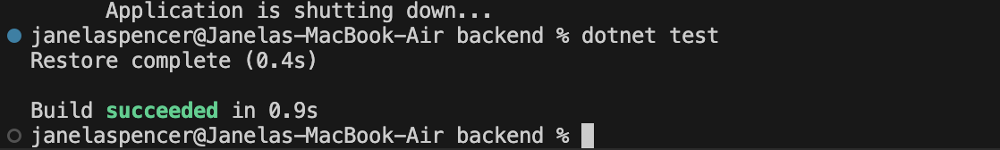
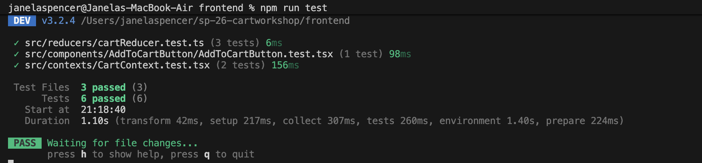
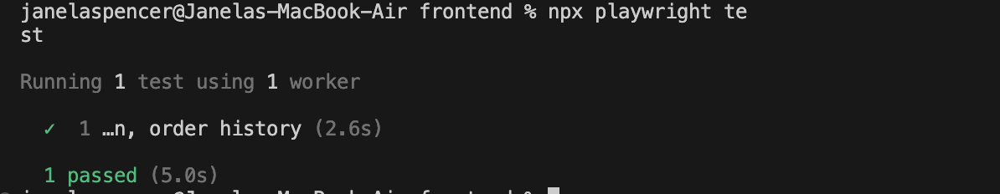

# Testing Evidence
## Prompts Used with Testing Agent
This is one of the prompts I used with my testing agent: 
"Tell me the best candidates for three backend unit tests, 
one backend integration test, three frontend unit tests, 
and one E2E happy-path test. Do not edit code yet."

## Test Commands and Results

### Backend Tests
Result: passed

### Frontend Tests
Result: 6 passed

### E2E Tests
Result: 1 passed

